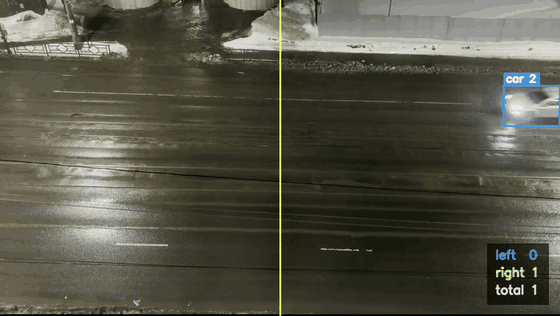
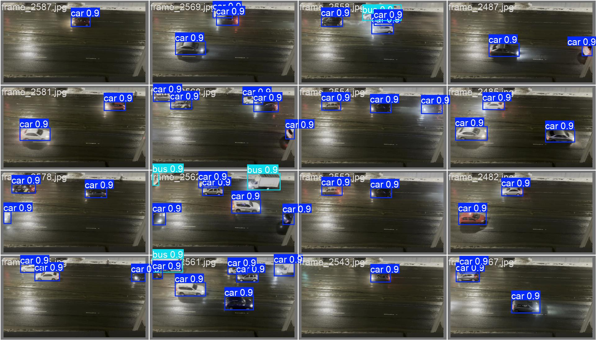
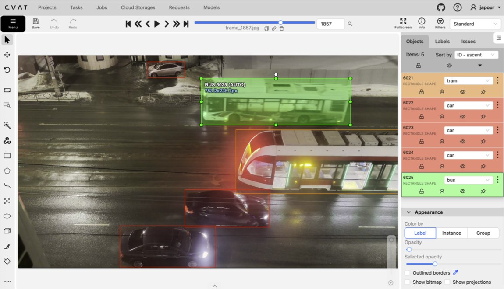
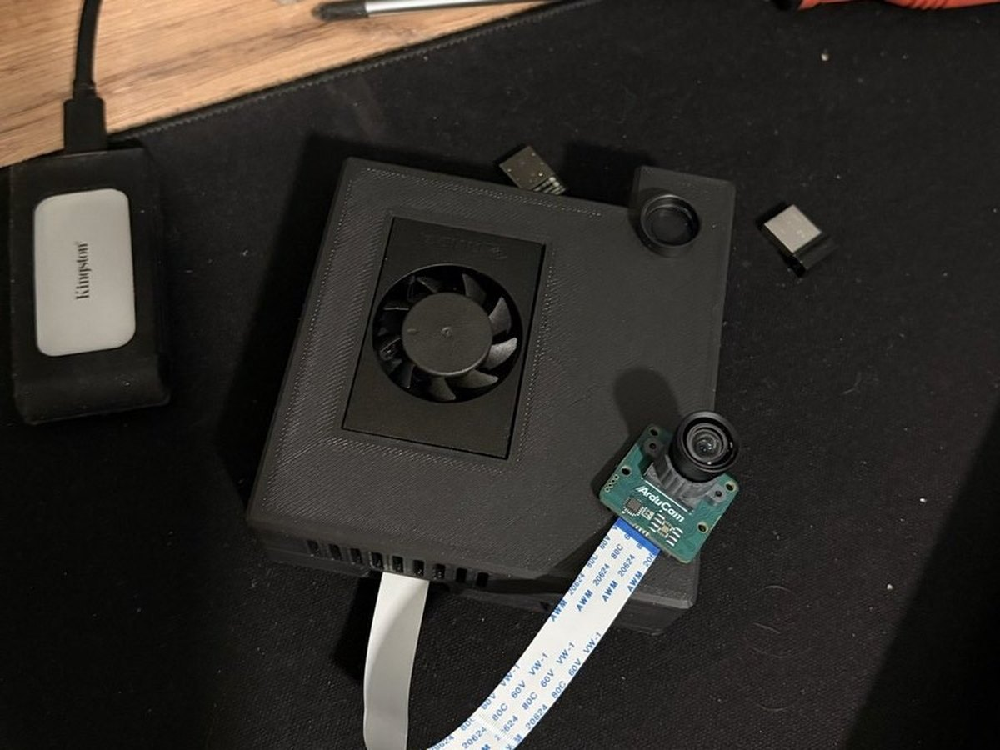
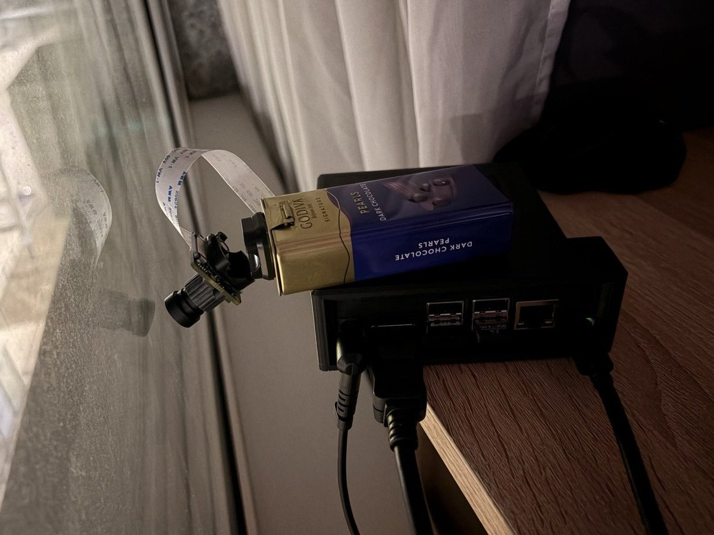

# Подсчет транспорта в видеопотоке

Система считает машины, автобусы и трамваи на видео с неподвижной камеры,
различает их по типам и определяет направление движения. Работает с
видеофайла, с веб-камеры и с CSI-камеры NVIDIA Jetson.

Детекция на YOLO11l, дообученной на собственном датасете. Сопровождение
между кадрами делает BoT-SORT, подсчет идет по факту пересечения
виртуальной линии.



*Реальный выход системы: детекция, id треков, счетчик по направлениям.
Ночь, мокрый асфальт, блики фар. Тот же материал, на котором обучалась
модель.*

Первый этап закончен и описан ниже целиком. Второй датасет уже собран и
размечен: съемка с целевой камеры на Jetson, день и ночь. Осталось обучить
на нем модель под Jetson. Ниже честно написано, что работает, а что нет.

---

## Что получилось

Метрики модели на валидационной выборке первого этапа (2333 кадра):

| Класс | Precision | Recall | mAP50 | mAP50-95 |
|---|---|---|---|---|
| Все классы | 0.912 | 0.953 | 0.960 | 0.882 |
| car | 0.991 | 0.980 | 0.993 | 0.900 |
| bus | 0.897 | 0.935 | 0.937 | 0.851 |
| tram | 0.847 | 0.944 | 0.948 | 0.894 |

Тест подсчета: минута ночной записи, ручной подсчет против
автоматического. 22 транспортных средства, 11 влево и 11 вправо,
расхождений ноль.



<p align="center">
  
  
</p>

Полные графики обучения и лог по эпохам лежат в
[docs/results.md](docs/results.md).

## Где границы этих цифр

Метрики выше сняты на первом датасете, поэтому читать их надо так:

- **Только ночь.** Первый датасет снят ночью с одной точки. День, дождь и
  снег не проверял. Второй датасет это закрывает, там есть и дневная
  съемка.
- **Трамваев мало.** 7159 машин, 409 автобусов, 114 трамваев. Метрика по
  трамваю посчитана на сотне объектов, отсюда же часть путаницы bus и tram
  в матрице ошибок.
- **Валидация нарезана из той же записи.** Соседние кадры почти одинаковы
  и случайное разбиение развело их по обеим выборкам, так что настоящие
  цифры ниже. В `scripts/split_dataset.py` теперь по умолчанию разбиение
  по времени, случайный режим оставлен только чтобы воспроизвести таблицу.
- **Тест подсчета короткий.** Минута и 22 машины показывают, что конвейер
  сходится, а не точность на плотном потоке.

Все это лечится вторым датасетом и переобучением, это следующий шаг.

## Как устроено

```
кадр из видео
  YOLO11 находит машины
  BoT-SORT держит один и тот же id между кадрами
  LineCounter считает пересечения линии
  итог в консоль и CSV
```

Всего три файла в `src/vehicle_counting/`:

| Файл | Что делает | Строк |
|---|---|---|
| `counter.py` | вся логика подсчета, без OpenCV и YOLO | 75 |
| `render.py` | рисует рамки, линию и панель | 55 |
| `main.py` | читает видео, зовет модель, печатает итог | 130 |

Логика подсчета лежит отдельно от всего остального специально: она не
зависит ни от OpenCV, ни от весов модели, поэтому ее можно прогнать
тестами, не запуская видео:

```bash
pytest          # 10 тестов, доли секунды
```

Тесты в [`tests/test_counter.py`](tests/test_counter.py) описывают те
случаи, которые ломали счетчик на реальном видео: машина стоит на линии в
пробке и дрожит, машина разворачивается и уезжает обратно, трекер выдает
старый id новой машине.

Два решения пришлось найти отдельно, оба после того, как счет поехал.

У линии есть зона нечувствительности. Машина, вставшая ровно на линии на
красный свет, давала десятки ложных проездов, потому что рамка детектора
дрожит на пиксель туда-обратно. Теперь переход засчитывается, только когда
объект отошел от линии дальше `min_travel`.

Старые треки забываются. Наивная реализация копит `track_id` в словарях
вечно, и на суточном прогоне это утечка памяти. Трек, которого не видно
`forget_after` кадров, удаляется.

## Запуск

```bash
git clone https://github.com/Japour/vehicle-counting.git
cd vehicle-counting
pip install -r requirements.txt
```

Веса модели в репозиторий не входят. Файл `best.pt` кладется в `models/`
(см. [docs/dataset.md](docs/dataset.md)).

```bash
# посчитать по видеофайлу и записать результат
python -m vehicle_counting --source road.mp4 --save-video out.mp4 --save-csv crossings.csv

# с камеры и с окном
python -m vehicle_counting --source 0 --show
```

На выходе:

```
кадров обработано: 1500
влево:  11
вправо: 11
всего:  22
  left: bus 1, car 10
  right: car 11
```

И CSV, где каждая строка это один проезд:

```csv
frame,sec,track_id,class,direction
15,0.5,1,car,right
133,4.43,2,car,left
```

## Датасет

Данные собраны с нуля, готовых наборов не использовалось. Подробно все
расписано в [docs/dataset.md](docs/dataset.md), коротко так.

Первый датасет снял на телефон с балкона четвертого этажа: 43 минуты
видео 1920×1080, ночь, четырехполосная дорога. Нарезал по кадру в секунду,
вышло 2600 изображений. Разметил в CVAT, 267 кадров выбросил как брак или
как кадры без транспорта. Итог: 2333 размеченных изображения, 1867 train
и 467 val.



*Разметка в CVAT: ночной кадр, рамки на машины, автобус и трамвай. Тем же
способом размечены и все 11.7 тысяч кадров второго датасета.*

Предразметку тогда делал стоковой YOLO11n, и это оказалось слабым местом.
Она размечает классами COCO, путает трамвай с поездом и автобусом, правок
вышло почти столько же, сколько заняла бы разметка с нуля.

Дальше поставил на Jetson камеру Arducam и снимал уже ей. Кадр раз в
5 секунд, набралось около 11.7 тысяч: день и ночь, полная разметка в CVAT.
Предразметку в этот раз делал моделью первого этапа, она уже знает нужные
три класса и этот ракурс, так что мне оставалось только проверять.

<p align="center">
  
  
</p>

*Слева стенд на столе: Jetson Orin Nano в печатном корпусе и камера
Arducam на шлейфе. Справа он же на подоконнике во время съемки. Штатива не
было, стойкой послужила коробка конфет.*

Смысл второго датасета в том, чтобы уйти от одной ночи, снятой телефоном,
к съемке с той камеры и того ракурса, на которых система будет работать, и
закрыть дневное освещение. Осталось обучить на нем модель полегче под
Jetson и сравнить с текущими весами.

## Что дальше

- [ ] обучить модель полегче на датасете второго этапа и сравнить с текущей
- [ ] экспорт в TensorRT FP16 и замер реального FPS на Jetson ([docs/jetson.md](docs/jetson.md))
- [ ] тест на плотном потоке с перекрытием машин
- [ ] несколько линий подсчета в кадре, по одной на полосу

## Стек

Python 3.10+, Ultralytics YOLO11, OpenCV, BoT-SORT, CVAT, PyTorch/CUDA.
Обучение шло на RTX 4070 Ti 12 ГБ, целевая платформа Jetson Orin Nano 8 ГБ.

## Автор

Под этот проект изучал основы OpenCV, устройство YOLO и трекинг объектов
между кадрами. Датасет, обучение и алгоритм подсчета через виртуальную
линию мои, включая ошибки, описанные выше. Код потом рефакторил с
ИИ-инструментами.

Учусь в частном IT-колледже, параллельно веду свои треки по Linux и системе.

GitHub: [@Japour](https://github.com/Japour)

## Лицензия

Код выложен для ознакомления: посмотреть и разобрать можно. Использовать,
копировать, изменять и включать в свои проекты - только с моего разрешения.
Подробнее в [LICENSE](LICENSE).
