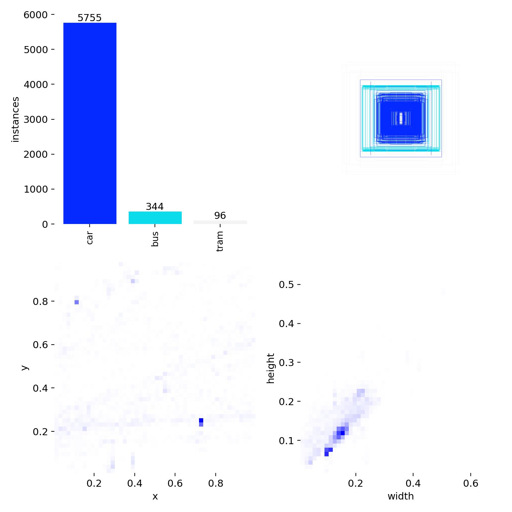

# Датасет

Готовые наборы не использовались: цель была пройти весь путь от съемки до
обученной модели самому и понять, где он ломается.

## Этап 1 - телефон с балкона (готов)

### Съемка

Балкон четвертого этажа, четырехполосная городская дорога, ночь, уличное
освещение. Камера смартфона, 1920×1080, 43 минуты непрерывной записи.
Ракурс неподвижный - это условие для работы компенсации движения камеры в
BoT-SORT и для того, чтобы линия подсчета имела смысл.

Ночь выбрана не специально, так совпало, и это дорого обошлось: датасет
получился односезонным и однорежимным (см. ограничения в README).

### Нарезка кадров

```bash
python scripts/extract_frames.py road.MOV data/frames --every 1.0
```

Один кадр в секунду, то есть каждый 25-й. Чаще брать нельзя: при 25 fps
соседние кадры отличаются на несколько пикселей, они не дают модели новой
информации, зато раздувают датасет и попадают одновременно в train и val.

Получилось 2600 кадров.

### Разметка

Разметка в [CVAT](https://www.cvat.ai) (облачная версия), три класса:
`car`, `bus`, `tram` - именно в этом порядке, он задает id 0/1/2.

Сначала предразметка стоковой YOLO11n через `cvat-sdk`: скрипт забирал
кадры из задачи, прогонял через модель, конвертировал результат в формат
CVAT и заливал обратно. Затем ручная проверка каждого кадра - правка рамок,
удаление ложных срабатываний, добавление пропущенных объектов.

Предразметка стоковой моделью себя не оправдала. YOLO11n обучена на COCO и
размечает его классами: трамвай уходит в `train` или `bus`, ночные машины
пропускаются, появляются рамки на фонарях и рекламе. Правок вышло почти
столько же, сколько заняла бы разметка с нуля. Полезной она становится
только тогда, когда предразмечает своя модель на своих классах, что и
делается на втором этапе.

267 кадров выброшено: смазанные, засвеченные фарами, без транспорта в кадре.

### Экспорт и разбиение

Из CVAT - экспорт в формате YOLO 1.1. Затем:

```bash
python scripts/split_dataset.py data/frames data/labels data/dataset --split-by random --seed 42
```

Итог: **2333 изображения**, 1867 train / 467 val.

Распределение объектов по классам:

| Класс | Объектов | Доля |
|---|---:|---:|
| car | 7159 | 93.2 % |
| bus | 409 | 5.3 % |
| tram | 114 | 1.5 % |

Дисбаланс отражает реальный поток на этой дороге, но для обучения он
неудобен: метрики по трамваю посчитаны на сотне объектов.



### Про `--split-by`

Метрики первого этапа получены на случайном разбиении (`random`, seed 42),
поэтому режим сохранен - иначе цифры в README нельзя воспроизвести.

Но по умолчанию в скрипте стоит `time`, и это осознанная замена. Кадры
нарезаны из одной непрерывной записи; при случайном разбиении кадр N уходит
в train, а кадр N+1 - в val, хотя это практически одно изображение. Модель
валидируется на том, что видела, и метрики завышены. Разбиение по времени
отдает в val последний кусок записи - честнее.

## Этап 2 - камера Jetson (в работе)

Первый датасет снят телефоном, а работать система должна с CSI-камеры
Jetson: другой сенсор, другая оптика, другой шум, другая высота установки.
Модель, обученная на телефонных кадрах, на этой камере теряет качество.

### Сбор

```bash
python scripts/capture_jetson.py data/frames_jetson --interval 5
```

Кадр раз в 5 секунд, сутками. Скрипт рассчитан на
долгий прогон: нумерация продолжается после перезапуска, подряд идущие
ошибки чтения ограничены, интервал не плывет от времени записи JPEG.
Запускается как systemd-юнит.

Собрано около **11.7 тысяч кадров**.

### Предразметка своей моделью

```bash
python scripts/autolabel.py models/best.pt data/frames_jetson data/labels_jetson --conf 0.25
python scripts/export_cvat.py data/labels_jetson build/cvat --zip
```

Теперь предразмечает модель первого этапа: она знает ровно три нужных
класса и похожий ракурс, поэтому мне остается только проверять.

Порог намеренно ниже боевого - 0.25 против 0.35. Лишнюю рамку удалить
одним кликом дешевле, чем заметить пропущенную среди тысяч кадров.

Пустой `.txt` для кадра без машин создается обязательно: для YOLO это
негативный пример, на котором модель учится пустой дороге. Если файла нет,
кадр молча выпадает из обучения.

Ловушка этого подхода: модель уверенно повторяет собственные ошибки, и без
ручной проверки датасет закрепляет их вместо того, чтобы исправлять.
Поэтому проверка в CVAT остается обязательным шагом, а не формальностью.

### Статус

Разметка проверена полностью. Дальше - объединение с
первым датасетом, переобучение и сравнение с текущими весами.

## Структура на диске

```
data/
|-- frames/            кадры этапа 1
|-- labels/            разметка YOLO
`-- dataset/
    |-- data.yaml
    |-- images/{train,val}/
    `-- labels/{train,val}/
```

`data.yaml` генерируется `split_dataset.py`:

```yaml
path: /абсолютный/путь/data/dataset
train: images/train
val: images/val
nc: 3
names:
  - car
  - bus
  - tram
```

Порядок имен обязан совпадать с `obj.names` для CVAT. Разошлись - разметка
поедет по классам, и заметно это станет только глазами.

## Что бы сделал иначе

1. Снимал бы день и ночь с самого начала.
2. Разбивал бы по времени сразу, а не случайно.
3. Не тратил бы время на предразметку стоковой моделью - на своих классах
   она не помогает.
4. Отложил бы часть записи в отдельный тест, который не участвует ни в
   обучении, ни в валидации.
