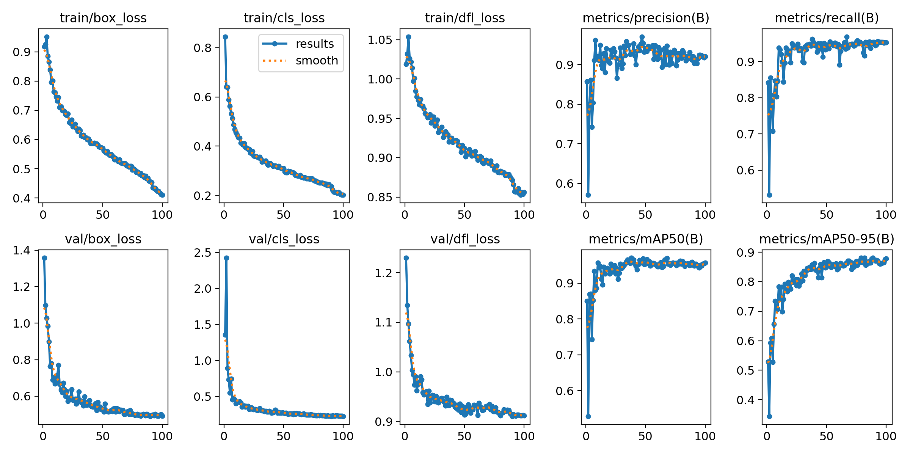
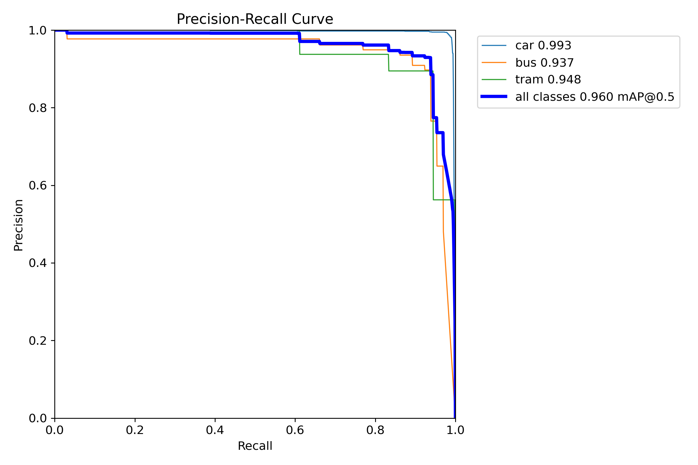
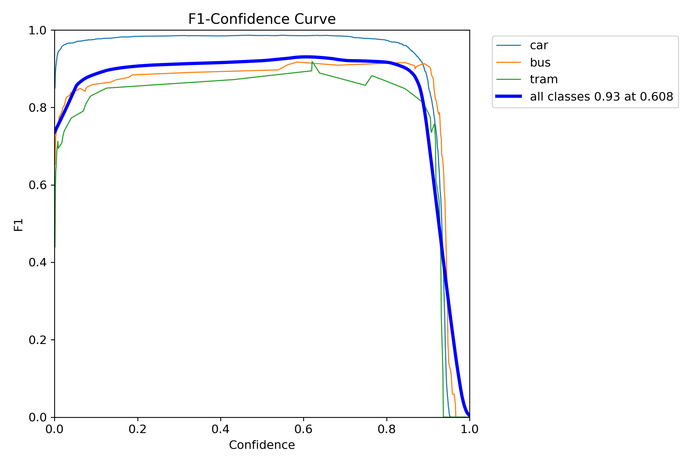
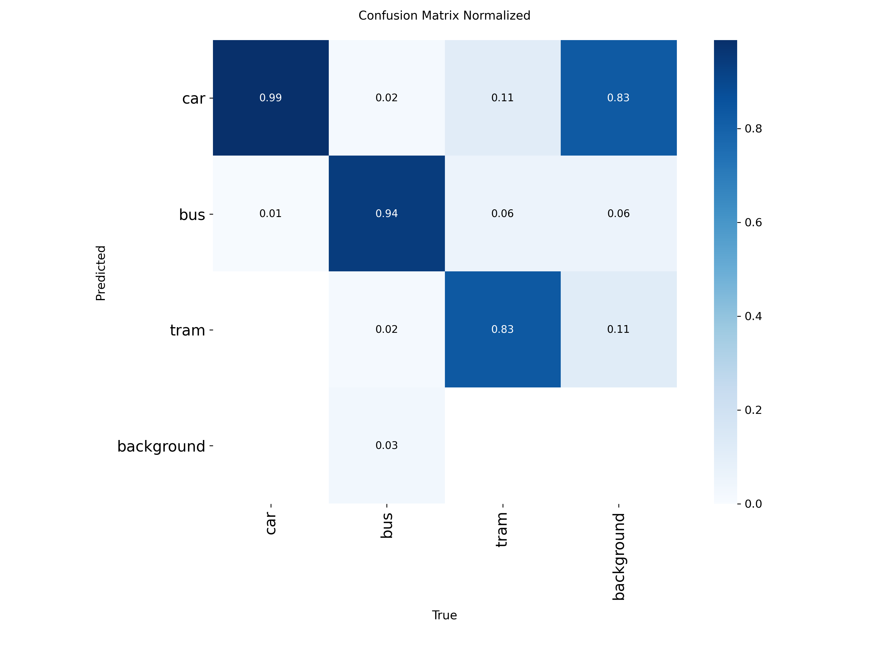

# Обучение и результаты

## Как обучалось

Дообучение (fine-tuning) от весов YOLO11l, предобученных на COCO. Свой
датасет - 2333 кадра - для обучения с нуля мал: transfer learning здесь не
оптимизация, а необходимость.

| Параметр | Значение |
|---|---|
| Модель | YOLO11l (25.3 M параметров) |
| Стартовые веса | COCO |
| Эпох | 100 |
| Batch | 16 |
| Размер входа | 640 |
| Оптимизатор | auto (Ultralytics) |
| lr0 | 0.01 |
| Железо | NVIDIA RTX 4070 Ti, 12 ГБ |

`batch=16` - потолок для 12 ГБ VRAM при 640×640 и модели `l`.

YOLO11l выбрана не как «самая большая из возможных»: на этом объеме данных
`x` переобучается быстрее, чем дает прирост, а `n` и `s` заметно хуже
находят трамваи на дальнем плане. `l` оказалась компромиссом - с оговоркой,
что на Jetson ее все равно придется гнать через TensorRT.

### Для Jetson модель будет другая

Этот выбор сделан под датасет первого этапа: 2333 кадра и видеокарта на
12 ГБ. Для второго этапа условия другие с обеих сторон.

Данных в разы больше: около 11-12 тысяч кадров с целевой камеры, дневная и
ночная съемка, полная разметка в CVAT. На таком объеме модели поменьше
перестают проигрывать. Тяжелая сеть нужна там, где данных мало и
приходится опираться на предобучение, а не там, где есть свой большой
размеченный набор с нужного ракурса и в разном освещении.

Требования тоже другие. На Jetson важны не столько метрики, сколько кадры
в секунду при 15 ваттах и объем памяти, которую делят CPU и GPU. `l` там
избыточна.

Поэтому на втором этапе беру модель полегче (`s` или `m`), обучаю на этом
датасете и сравниваю с текущими весами по трем показателям сразу: mAP, FPS
после экспорта в TensorRT и потребление. Итоговый размер выберу по
результатам сравнения.

Воспроизвести:

```bash
python scripts/train.py --data data/dataset/data.yaml --model yolo11l.pt --epochs 100 --batch 16
```

## Метрики

Валидация лучших весов (`best.pt`) на 467 отложенных кадрах:

| Класс | Precision | Recall | mAP50 | mAP50-95 |
|---|---|---|---|---|
| **Все классы** | **0.912** | **0.953** | **0.960** | **0.882** |
| car | 0.991 | 0.980 | 0.993 | 0.900 |
| bus | 0.897 | 0.935 | 0.937 | 0.851 |
| tram | 0.847 | 0.944 | 0.948 | 0.894 |

Лучшая эпоха по mAP50 - 38-я. Дальше метрика колебалась в пределах
0.95-0.97 без устойчивого роста: датасет исчерпан, добирать качество надо
данными, а не эпохами. Полный лог по эпохам - [training-log.csv](training-log.csv).



Кривые потерь на обучении и валидации снижаются согласованно, расхождения
между ними нет - явного переобучения не видно.

<p align="center">
  
  
</p>

### Матрица ошибок



Основная путаница между классами `bus` и `tram`. Причин две: сверху и сзади в темное
время у них похожий силуэт и габариты, и на трамвай приходится всего 114
размеченных объектов. Разделить эти причины на текущих данных нельзя.

### Почему по этим цифрам нельзя судить о проде

Метрики сняты на валидации, которая разбита случайно из одной непрерывной
записи. Соседние кадры почти идентичны и расходятся по train и val, так что
часть валидации модель фактически видела на обучении. Реальное качество на
новых данных ниже; насколько - на текущем датасете не измерить.

Это исправляется разбиением по времени (`--split-by time`, теперь по
умолчанию) и отдельным тестовым куском записи. Обе меры входят во второй
этап.

## Тест подсчета

Минута ночной записи, поток в обе стороны, умеренная интенсивность.
Методика: видео просмотрено вручную, для каждой машины зафиксированы
направление и момент пересечения линии, затем сравнение с выводом модуля.

| Показатель | Вручную | Автоматически |
|---|---|---|
| Всего | 22 | 22 |
| Влево | 11 | 11 |
| Вправо | 11 | 11 |
| Ошибок | - | 0 |

Ни одна машина не пропущена и не посчитана дважды, направление везде
определено верно, потерь трека и переназначения id не было.

Тест показывает, что связка детекции, трекинга и подсчета работает и не
сыплется на ровном месте. Точность в проде он не показывает: 22 объекта
это слишком малая выборка, поток умеренный, перекрытия машин почти нет.
На плотном трафике результат будет хуже, и это еще не измерено.

## Дальше

- переобучение на объединенном датасете двух этапов
- отложенный тестовый кусок, не участвующий в обучении и валидации
- тест на плотном потоке
- замер FPS TensorRT-движка на Jetson - [jetson.md](jetson.md)
